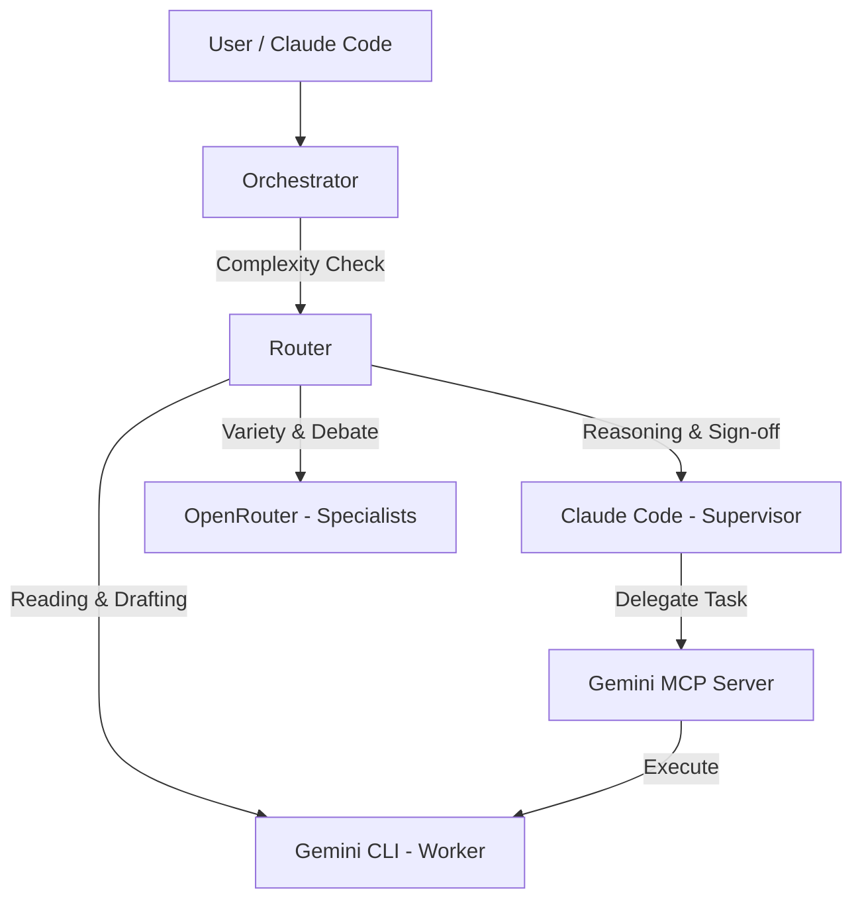

# Hybrid CLI Agent

> **Context Arbitrage for AI Engineering:** Combine **Claude Code** (precise reasoning) with **Gemini CLI** (massive context, free tier) and **OpenRouter** (400+ models) to cut costs by ~90% without sacrificing quality.


## 🚀 The Core Concept

**Reading is cheap, thinking is expensive.**

1.  **Gemini (The Reader):** Reads 100k+ tokens of logs, docs, and code. Summarizes, extracts, and researches. **Cost: FREE** (with Google account).
2.  **Claude (The Thinker):** Reviews summaries, makes architectural decisions, writes critical code, and supervises Gemini. **Cost: Paid** (but used sparingly).
3.  **OpenRouter (The Council):** Provides second opinions, specialized models (DeepSeek, Llama 3), and debates.

**Result:** You can "read" your entire codebase and "fix" complex bugs for pennies instead of dollars.

---

## ⚡ Quick Start

### 1. Installation
```bash
git clone https://github.com/yourusername/hybrid-cli-agent.git
cd hybrid-cli-agent
npm install
npm link  # Optional: makes 'hybrid' command available globally
```

### 2. Interactive Setup (Recommended)
Launch the configuration wizard to set up API keys and register with Claude Code automatically.

```bash
npm run setup
```
*Follow the prompts to authenticate Gemini (OAuth recommended for free tier) and optionally configure OpenRouter.*

### 3. Verify Status
Check which agents are ready and see your usage tier.

```bash
node bin/hybrid.js status
```

---

## 🛠️ Usage

You can use the `hybrid` CLI directly or let Claude Code drive via MCP.

### CLI Mode (Orchestrator)
The `hybrid` command automatically routes tasks to the most cost-effective capable model.

```bash
# Ask questions (Routes to Gemini for free context, Claude for complex reasoning)
node bin/hybrid.js ask "How does the authentication middleware work?"

# Research (Uses Gemini to read multiple files - FREE)
node bin/hybrid.js research "Find all places where we use deprecated APIs" -f "src/**/*.ts"

# Draft Code (Gemini drafts, Claude reviews - Supervisor Pattern)
node bin/hybrid.js draft src/utils/rate-limit.ts "Implement a sliding window rate limiter using Redis"

# Code Review (Gemini analyzes, Claude validates)
node bin/hybrid.js review src/services/ --focus "security"
```

### MCP Mode (Claude Code Integration)
Once installed (via `npm run setup`), you can talk to Claude Code naturally:

> "Analyze the logs in @logs/error.log and find the root cause of the crash."

Claude will see the `gemini-worker` tools and delegate the heavy reading to Gemini, receiving back a structured summary.

---

## 🔑 Authentication & Costs

| Provider | Best For | Setup | Cost |
|----------|----------|-------|------|
| **Gemini (OAuth)** | **Heavy Reading** | `gemini auth login` | **FREE** (within limits)* |
| **Claude** | **Complex Reasoning** | `claude login` | ~$3-15 / 1M tokens |
| **OpenRouter** | **Variety / Debates** | API Key | Varies by model |

### Gemini Free Tier Limits (December 2025)

The free tier is available via OAuth (`gemini auth login`) - no credit card required.

| Model | RPM | RPD | Best For |
|-------|-----|-----|----------|
| **gemini-2.5-flash** | 15 | 1,500 | General tasks, file reading |
| **gemini-2.5-flash-lite** | 15 | 1,500 | High-frequency, low-latency |
| **gemini-2.5-pro** | 2 | 50 | Complex reasoning (limited) |
| **gemini-3-pro-preview** | 2 | 50 | Frontier model (limited) |

> **Google One AI Premium ($19.99/mo):** ~5x higher limits + priority access to Gemini 3 Pro.

### When Free Limits Are Hit

The system automatically falls back when you exceed free tier limits:

1. **Primary:** `gemini-2.5-flash` (15 RPM / 1,500 RPD) - handles most tasks
2. **Fallback:** `gemini-2.5-flash-lite` if Flash quota exhausted
3. **Paid API:** If all free quotas hit, falls back to API key billing:

| Model | Input ($/1M) | Output ($/1M) |
|-------|--------------|---------------|
| gemini-2.5-flash-lite | $0.075 | $0.30 |
| gemini-2.5-flash | $0.10 | $0.40 |
| gemini-2.5-pro | $1.25-2.50 | $5.00-10.00 |
| gemini-3-pro | $2.50 | $10.00 |

> 💡 **Tip:** For most dev work, the free tier (1,500 requests/day) is plenty. You'll only hit paid API if doing heavy batch processing.

---

## 🧩 Features

### 🧠 Multi-Agent Orchestration
*   **Task Routing:** Automatically sends simple tasks to faster/cheaper models.
*   **Supervisor Loop:** Claude reviews code generated by Gemini before you see it.
*   **AI Collaboration:** Run debates or consensus checks between GPT-4, Claude, and Llama 3.

### 🛠️ 27+ MCP Tools
The system exposes a massive toolkit to Claude Code:

<details>
<summary><strong>View All Available Tools</strong></summary>

| Category | Tools | Description |
|----------|-------|-------------|
| **Agent** | `gemini_agent_task` | **POWERFUL:** Autonomous agent that can run shell commands, write files, and iterate tests. |
| **Reading** | `research_heavy_context` | Reads massive file sets without consuming Claude context. |
| **Coding** | `draft_code_implementation` | Generates initial code drafts for review. |
| **Analysis** | `gemini_code_review` | Structured code review with severity levels. |
| **Verification** | `gemini_verify_solution` | Checks solutions against requirements before deployment. |
| **Git** | `gemini_git_diff_review` | Analyzes staged changes before commit. |
| **Collaboration**| `ai_collaboration` | Running multi-model debates (e.g., "Monolith vs Microservices"). |
| **Conversation**| `gemini_start_conversation` | Stateful multi-turn conversations with history. |
| **System** | `gemini_cache_manage` | Manage the response cache (LRU). |

</details>

### ⚡ Performance Features
*   **Response Caching:** Caches Gemini responses (TTL 30m) to save time on repeated queries.
*   **@filename Syntax:** Reference files easily in prompts (`@src/config.js`).
*   **Token Tracking:** Real-time cost estimation per session.

---

## 🏗️ Architecture



## ⚙️ Configuration

The `npm run setup` script creates a `.env` file for you. You can also configure manually:

```bash
# .env file
GEMINI_AGENT_MODE=true        # Enable autonomous agent capabilities
OPENROUTER_API_KEY=sk-...     # Optional: For 400+ extra models
GEMINI_API_KEY=...            # Optional: If not using OAuth
```

**System-Wide Install:**
If you want to use the Gemini tools in *any* Claude Code project, the setup script registers the server globally in your `~/.claude/settings.json`.

---

## 📋 Claude System Instructions (Required)

For the **Context Arbitrage** pattern to work, Claude needs instructions on *when* and *how* to delegate to Gemini. This repo includes a `CLAUDE.md` file with these rules.

### Setup: Copy to System-Wide Location

Copy the contents of `CLAUDE.md` from this repo to your **global Claude instructions file**:

**Location:** `~/.claude/CLAUDE.md`
- **Windows:** `C:\Users\<YourUsername>\.claude\CLAUDE.md`
- **macOS/Linux:** `~/.claude/CLAUDE.md`

```bash
# Create the directory if it doesn't exist
mkdir -p ~/.claude

# Copy the file (adjust source path as needed)
cp CLAUDE.md ~/.claude/CLAUDE.md
```

> ⚠️ **Important:** If you already have a `~/.claude/CLAUDE.md`, merge the contents rather than overwriting. The key sections are the "Decision Matrix" and "Workflow" rules that tell Claude to delegate to `gemini_agent_task`.

### What It Does

The `CLAUDE.md` file instructs Claude to:
- **Delegate heavy reading** to Gemini (FREE) instead of using its own Read/Search tools ($$)
- **Use `gemini_agent_task`** for coding, testing, R&D, and documentation
- **Only act directly** for final approvals, git commits, and single tiny fixes
- **Review Gemini's output** before accepting it

This is what enables the ~90% cost savings. Without these instructions, Claude will do everything itself at full price.

---

## 🤝 Contributing

1.  Fork the repo
2.  Create your feature branch (`git checkout -b feature/amazing-feature`)
3.  Commit your changes (`git commit -m 'Add some amazing feature'`)
4.  Push to the branch (`git push origin feature/amazing-feature`)
5.  Open a Pull Request

## 📄 License

Distributed under the MIT License. See `LICENSE` for more information.

---

**Disclaimer:** This tool is designed for local development use. Enabling `GEMINI_AGENT_MODE` allows the AI to execute shell commands and modify files. Always review actions in critical environments.