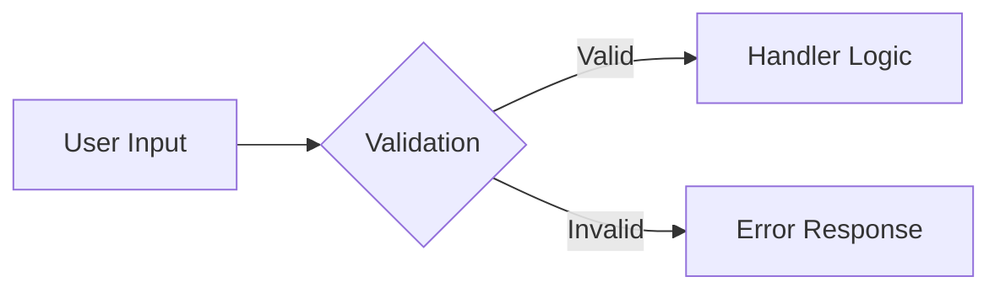

# Hybrid CLI Agent - Finalized Development Plan

**Project:** Hybrid-CLI-Agent v0.3.6 → v0.3.10  
**Date:** January 12, 2026  
**Status:** Ready for Implementation

---

## Executive Summary

The Hybrid-CLI-Agent has made excellent progress through v0.3.6 with P0 items complete (Flash model removal, background mode, PENDING_REVIEW workflow). However, a comprehensive codebase review revealed **critical utility modules that were implemented but never integrated** into the actual tool handlers.

This plan consolidates all findings and provides a phased roadmap to complete the integration.

---

## Current State (v0.3.6)

### ✅ Completed Work

| Feature | Version | Status |
|---------|---------|--------|
| Flash model removal | v0.3.6 | ✅ Done |
| Pro-only model selection | v0.3.6 | ✅ Done |
| Background task mode | v0.3.7 | ✅ Done |
| PENDING_REVIEW workflow | v0.3.6 | ✅ Done |
| `gemini_agent_approve` tool | v0.3.6 | ✅ Done |
| Configurable stall timeout | v0.3.7 | ✅ Done |
| Error utilities (`analyzeStderr`, `createTypedError`) | v0.3.6 | ✅ Done |

### 🔴 Critical Gaps Identified

| Gap | Impact | Priority |
|-----|--------|----------|
| No input validation | Invalid inputs reach CLI | 🔴 High |
| Simple retry logic | Rate limits not handled properly | 🔴 High |
| Duplicate rate limit code | DRY violation | 🟠 Medium |
| `withErrorHandling` unused | Inconsistent errors | 🟡 Low |

---

## Unused Utility Summary

### validation.js - 11 Functions UNUSED

```
validatePrompt, validateModel, validateFilePatterns,
validateSources, validatePositiveInteger, validateEnum,
validateObject, validateTemperature, validateConversationId,
aggregateValidations, LIMITS
```

**Tests exist:** [tests/validation.test.js](file:///o:/Development/MCP-Servers/Hybrid-CLI-Agent/tests/validation.test.js) (48 tests passing)

### retry.js - 5 Utilities UNUSED

```
withRetry, createRetryWrapper, RateLimitTracker,
getRateLimitTracker, isRetryable
```

**Tests exist:** [tests/retry.test.js](file:///o:/Development/MCP-Servers/Hybrid-CLI-Agent/tests/retry.test.js)

### base.js - 1 HOF UNUSED

```
withErrorHandling (added v0.3.6, never applied)
```

**Tests exist:** [tests/tool-handlers-error.test.js](file:///o:/Development/MCP-Servers/Hybrid-CLI-Agent/tests/tool-handlers-error.test.js)

---

## Implementation Phases

### Phase 1: Input Validation (v0.3.7)

**Risk:** Low | **Effort:** 2-3 hours | **Breaking:** No



#### Changes

| File | Modification |
|------|--------------|
| [tool-handlers/agent/index.js](file:///o:/Development/MCP-Servers/Hybrid-CLI-Agent/src/mcp/tool-handlers/agent/index.js) | Add validation calls to [handleGeminiAgentTask](file:///o:/Development/MCP-Servers/Hybrid-CLI-Agent/src/mcp/tool-handlers/agent/index.js#873-1166) |
| [gemini-mcp-server.js](file:///o:/Development/MCP-Servers/Hybrid-CLI-Agent/src/mcp/gemini-mcp-server.js) | Add validation to `runGeminiPrompt` |

#### Validation Rules

| Input | Validation | Limit |
|-------|------------|-------|
| `task_description` | Non-empty, max length | 100k chars |
| `model` | Must be in VALID_MODELS | - |
| `context_files` | Valid glob array | 50 patterns max |
| `max_iterations` | Positive integer | 1-100 |

---

### Phase 2: Retry Utilities (v0.3.8)

**Risk:** Medium | **Effort:** 2-3 hours | **Breaking:** No (timing changes)

#### Changes

| File | Modification |
|------|--------------|
| [tool-handlers/agent/index.js](file:///o:/Development/MCP-Servers/Hybrid-CLI-Agent/src/mcp/tool-handlers/agent/index.js) | Replace simple loop with [withRetry](file:///o:/Development/MCP-Servers/Hybrid-CLI-Agent/src/utils/retry.js#120-179) |
| [gemini-mcp-server.js](file:///o:/Development/MCP-Servers/Hybrid-CLI-Agent/src/mcp/gemini-mcp-server.js) | Replace inline tracker with [getRateLimitTracker()](file:///o:/Development/MCP-Servers/Hybrid-CLI-Agent/src/utils/retry.js#285-296) |

#### Backoff Progression

```
Attempt 1: Immediate
Attempt 2: ~2s (+ jitter)
Attempt 3: ~4s (+ jitter)
Attempt 4: ~8s (+ jitter)
...capped at 30s
```

---

### Phase 3: Error Handling (v0.3.9)

**Risk:** Low | **Effort:** 1-2 hours | **Breaking:** No

#### Changes

| File | Modification |
|------|--------------|
| [tool-handlers/agent/index.js](file:///o:/Development/MCP-Servers/Hybrid-CLI-Agent/src/mcp/tool-handlers/agent/index.js) | Wrap exports with `withErrorHandling` |
| `tool-handlers/core/index.js` | Wrap exports with `withErrorHandling` |
| `tool-handlers/system/index.js` | Wrap exports with `withErrorHandling` |

#### Error Response Format (after)

```json
{
  "type": "RateLimitError",
  "message": "Rate limit exceeded for gemini-3-pro",
  "recovery": "Wait 60 seconds or try a different model",
  "retryable": true
}
```

---

### Phase 4: Documentation (v0.3.10)

**Risk:** None | **Effort:** 1 hour | **Breaking:** No

| File | Update |
|------|--------|
| CHANGELOG.md | Add entries for v0.3.7-v0.3.10 |
| TODO.md | Mark issue #9 (Missing Input Validation) resolved |
| CLAUDE.md | Note validation behavior |

---

## Files to Modify

| File | Phase | Changes |
|------|-------|---------|
| [agent/index.js](file:///o:/Development/MCP-Servers/Hybrid-CLI-Agent/src/mcp/tool-handlers/agent/index.js) | 1, 2, 3 | Validation + withRetry + withErrorHandling |
| [gemini-mcp-server.js](file:///o:/Development/MCP-Servers/Hybrid-CLI-Agent/src/mcp/gemini-mcp-server.js) | 1, 2 | Validation + RateLimitTracker |
| [core/index.js](file:///o:/Development/MCP-Servers/Hybrid-CLI-Agent/src/mcp/tool-handlers/core/index.js) | 3 | withErrorHandling |
| [system/index.js](file:///o:/Development/MCP-Servers/Hybrid-CLI-Agent/src/mcp/tool-handlers/system/index.js) | 3 | withErrorHandling |
| CHANGELOG.md | 4 | Version entries |
| TODO.md | 4 | Mark resolved |

---

## Verification Strategy

### Automated Testing

```bash
npm test                                    # All 677+ tests
npm test -- --grep "Validation"             # validation.test.js
npm test -- --grep "Retry"                  # retry.test.js  
npm test -- --grep "Error"                  # error tests
```

### New Integration Tests

**File:** `tests/validation-integration.test.js`

- Reject empty `task_description`
- Reject prompts > 100k chars
- Reject invalid model names
- Reject > 50 context file patterns

### Manual Verification

1. Start MCP server: `npm run mcp`
2. Call `gemini_agent_task` with invalid inputs → expect validation error
3. Simulate rate limit → verify exponential backoff logs

---

## Success Criteria

| # | Criterion | Phase |
|---|-----------|-------|
| 1 | All validation functions imported and used | 1 |
| 2 | [withRetry](file:///o:/Development/MCP-Servers/Hybrid-CLI-Agent/src/utils/retry.js#120-179) replaces simple retry loop | 2 |
| 3 | [RateLimitTracker](file:///o:/Development/MCP-Servers/Hybrid-CLI-Agent/src/utils/retry.js#195-281) replaces inline tracker | 2 |
| 4 | `withErrorHandling` wraps all handler exports | 3 |
| 5 | All 677+ tests continue passing | All |
| 6 | New integration tests added and passing | 1 |
| 7 | TODO.md issue #9 marked resolved | 4 |

---

## Timeline

| Phase | Version | Estimated | Dependencies |
|-------|---------|-----------|--------------|
| Phase 1 | v0.3.7 | 2-3 hours | None |
| Phase 2 | v0.3.8 | 2-3 hours | Phase 1 |
| Phase 3 | v0.3.9 | 1-2 hours | Phase 2 |
| Phase 4 | v0.3.10 | 1 hour | Phase 3 |
| **Total** | - | **~8 hours** | - |

---

## Future Considerations (P3)

| Item | Status |
|------|--------|
| OpenRouter reimplementation | Tabled |
| AICollaboration reimplementation | Tabled |
| ClaudeCode adapter removal | Under review |
| Task templates system | TODO |

---

*Plan finalized. Ready for implementation.*
